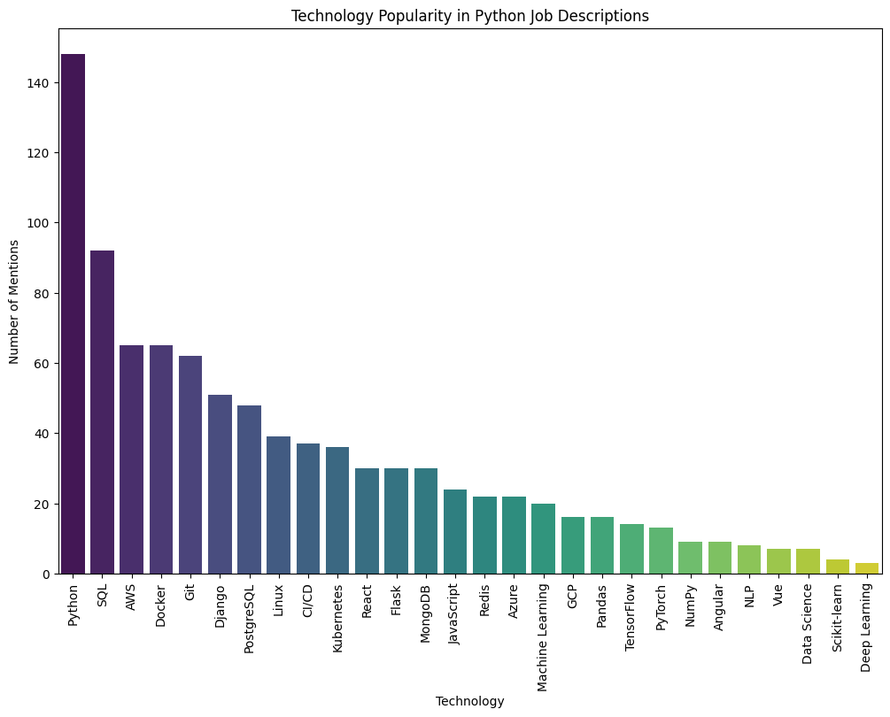

# Python Job Market Analysis

## Project Description

This project scrapes Python developer job listings from a job portal and analyzes the most demanded technologies. The analysis includes:

- Distribution of vacancies by cities
- Popularity of technologies in job descriptions
- Technology mentions by experience level (Junior, Mid, Senior)
- Correlation analysis between different technologies, experience levels, and cities




**Data Source:** The job listings were scraped from the job portal **[DOU.ua.](https://jobs.dou.ua/vacancies/?category=Python)**

## Installation

1. **Clone the repository**:
    ```bash
    git clone https://github.com/your-username/python-job-market-analysis.git
    cd python-job-market-analysis
    ```

2. **Create a virtual environment**:
    ```bash
    python -m venv venv
    source venv/bin/activate # On Windows, use `venv\Scripts\activate`
    ```

3. **Install required packages**:
    ```bash
    pip install -r requirements.txt
    ```

4. **Download and install ChromeDriver**:
    Ensure you have [ChromeDriver](https://sites.google.com/a/chromium.org/chromedriver/downloads) installed and it matches your installed Chrome version. Place it in a directory included in your system's PATH.

## Usage

1. **Scrape job listings**:
    Run the scraper to collect data:
    ```bash
    python scraper.py
    ```

2. **Analyze the data**:
    Open the Jupyter Notebook to perform data analysis:
    ```bash
    jupyter notebook analysis.ipynb
    ```

